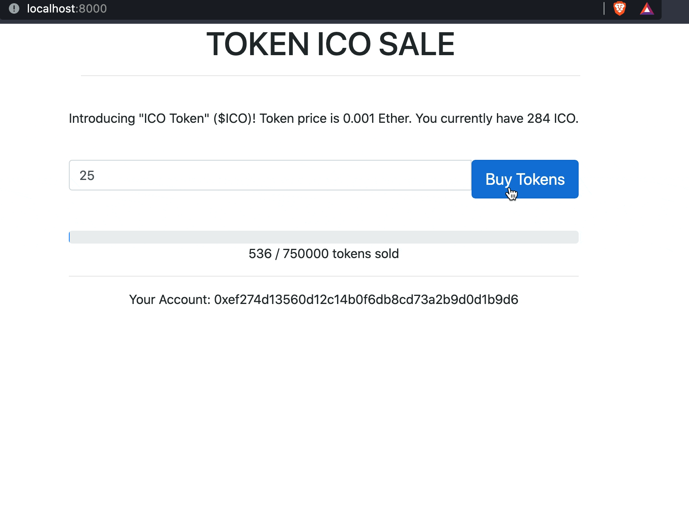

# 🏛️ `$ICO` Token

### Stage 1: ICO for `$ICO`

> Based on the Youtube tutorial ["Code Your Own Cryptocurrency on Ethereum"](https://www.youtube.com/playlist?list=PLS5SEs8ZftgWFuKg2wbm_0GLV0Tiy1R-n) by [Dapp University](https://www.youtube.com/channel/UCY0xL8V6NzzFcwzHCgB8orQ).

Create a ERC-20 token `$ICO` for investors to purchase the tokens using `$ETH` during [the ICO phase](https://www.investopedia.com/terms/i/initial-coin-offering-ico.asp).

- [Smart contract structure](https://docs.openzeppelin.com/contracts/2.x/api/token/erc20).
- [Guide using the Solidity language](https://docs.soliditylang.org/en/v0.4.24/introduction-to-smart-contracts.html).

## Basic Concepts

### [Token vs Cryptocurrency vs Altcoins](https://www.investopedia.com/terms/c/crypto-token.asp)

Cryptocurrency is a standard currency used for making or receiving payments on a blockchain.

Altcoins are alternative cryptocurrencies launched after the success achieved by Bitcoin (aka other than Bitcoin) (e.g. Litecoin, Dogecoin).

Tokens operate on top of a blockchain that act as a medium for the creation and execution of decentralized apps and smart contracts to facilitate the transactions.

### What is [ERC-20](https://ethereum.org/en/developers/docs/standards/tokens/erc-20/)?

It is a list of rules that all Etherum-based tokens must follow, which tokens are used for transactions (e.g. smart contracts) on the Ethereum blockchain network. The token used within this chain is called the Etherum token.

This is the same thing similar to [BIPS protocol](https://github.com/bitcoin/bips) used for Bitcoin, except that on Etherum network, one is able to build a [decentralised app](https://en.wikipedia.org/wiki/Decentralized_application), unlike Bitcoin which serves as an asset.

### [What is the Blockchain Network?](https://en.wikipedia.org/wiki/Blockchain)

(Source: [Raj Jain et., 2018](https://www.researchgate.net/publication/326888946_Security_Services_Using_Blockchains_A_State_of_the_Art_Survey) - _Overview of the entire blockchain network with nodes, that each contains blocks_)

(Source: [Jimi S., 2018](https://blog.goodaudience.com/blockchain-for-beginners-what-is-blockchain-519db8c6677a) - _Overview of blocks, which contains a string of transactions and hash_)

(Source: [@xcsob, 2018](https://bitcoin.stackexchange.com/questions/72161/how-the-recipients-public-key-is-used-in-bitcoin-transaction) - _Overview of transactions that forms an entire block_)

From Wikipedia, 

> It is growing list of records (called blocks) that are linked together using cryptography.
> 
> Each block contains a cryptographic hash of the previous block, a timestamp, and transaction data (generally represented as a [Merkle tree](https://en.wikipedia.org/wiki/Merkle_tree)). 
> 
> The timestamp proves that the transaction data existed when the block was published in order to get into its hash. 
> 
> As blocks each contain information about the block previous to it, they form a chain, with each additional block reinforcing the ones before it.
> 
> Therefore, blockchains are resistant to modification of their data because once recorded, the data in any given block cannot be altered retroactively without altering all subsequent blocks.
> 
> Blockchains are typically managed by a peer-to-peer network for use as a publicly distributed ledger, where nodes collectively adhere to a protocol to communicate and validate new blocks

Here's an example of the Bitcoin (BTC) network,

(Source: [Brian.Wu, 2019](https://blog.bybit.com/en-us/learn/crypto-101/bitcoin-blockchain-performance-and-scalability/))

(Source: [Michele D'Aliessi, 2016](https://onezero.medium.com/how-does-the-blockchain-work-98c8cd01d2ae))

Here's an example of an Etherum transaction,

(Source: [andryo.com, n.d.](https://www.andryo.com/en/blockchain/how-to-verify-transactions-on-the-blockchain/))

### [What are smart contracts?](https://www.computerworld.com/article/3412140/whats-a-smart-contract-and-how-does-it-work.html)

Smart contracts are self-executing, business automation applications that run on a decentralized network such as blockchain. 

For example, an insurance company could use smart contracts to automate the release of claim money based on events such as large-scale floods, hurricanes or droughts. Or, once a cargo shipment reaches a port of entry and IoT sensors inside the container confirm the contents have been unopened and remained stored properly throughout the journey, a bill of lading can automatically be issued.

[Decentralized apps (dapps)](https://ethereum.org/en/developers/docs/dapps) is an application built on a decentralized network that combines a smart contract and a frontend user interface. It has its own backend code running on a decentralized peer-to-peer network (unlike backend code running on centralized servers like AWS). It may have a frontend code which may be hosted on decentralized storage such as [IPFS](https://en.wikipedia.org/wiki/InterPlanetary_File_System).

### [What are Oracles?](https://en.wikipedia.org/wiki/Blockchain_oracle)

From Wikipedia,

> A blockchain oracle is a third-party service that provides smart contracts with information from the outside world. It is the layer that queries, verifies, and authenticates external data sources, usually via trusted APIs and then relays that information.
> 
> Examples of data transmitted by oracles to smart contracts include price information, the successful completion of a payment, the temperature measured by a sensor, election outcomes etc. 
> 
> Data can be supplied by other software (databases, servers, or essentially any online data source), or by hardware (sensors, barcode scanners etc.). 

Note that the records data is centralized to oracles. It's akin to an extra record data tied to these transactions.

### What are Wallets?

(Source: [simplilearn.com, n.d.](https://www.simplilearn.com/tutorials/blockchain-tutorial/blockchain-wallet))

A cryptocurrency wallet allows users to manage different users to manage different kinds of cryptocurrencies (e.g. Bitcoin/Etherum).

It contains the user keys information (e.g. private and public keys) used for transactions.

**Hot wallets** are online wallets through which cryptocurrencies can be transferred quickly (e.g. Coinbase or Binance). **Cold wallets** are digital offline wallets where the transactions are signed offline and then disclosed online (e.g. Trezor or Ledger).

There are **Software wallets** that exists in the desktop, mobile or online (managed by 3rd parties), or **Hardware wallets**, a type of cold storage device, typically like a USB, that stores the user’s private key in a protected hardware device (e.g. Trezor).

